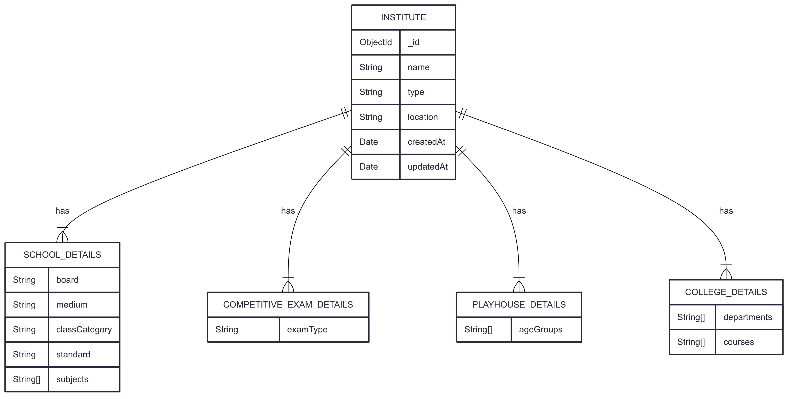

# StackDot - Node.js Backend Task

<!--  -->
### Database Schema

#### 1. Institute (DB Table)
    - name 
    - type
    - location 
    - schoolDetails (type - schoolDetailsSchema)
    - competitiveExamDetails: (type - competitiveExamSchema)
    - playHouseDetails: (type - playHouseSchema)
    - collegeDetails: (type - collegeSchmema)
  
#### 2. schoolDetailSchema
    - board
    - medium
    - standard
    - subjects
  
#### 3. competitiveExamSchema
    - examType
  
#### 4. playHouseSchema
    - ageGroups

#### 5. collegeSchmema
    - departments
    - courses

## Visual Representation:

### API EndPoints:

#### 1. POST /api/institute/create -  create Institute

#### 2. GET /api/institute/:id - Institute By Id

## Application Flow :
    - Client request --> Router(routes based on request) --> Controller(handle api EndPoints) --> Services(actual Logic) - return back response

## Database Credentials: (create  .env file)
    - PORT : YOUR_PORT
    - MONGO_URI : YOUR_MONGO_URI

## Clone Repository:
    git clone https://github.com/danishppatel/StackDot--Test.git

## Start Application:
    - npm install
    - nodemon server.js
  
